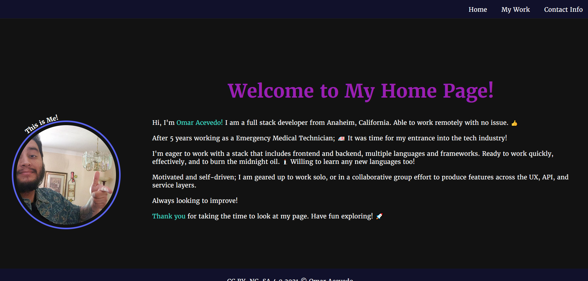

# 02-Portfolio

## Description

I have created a website portfolio to make myself more marketable to employers and showcase my HTML and CSS Skills.

## Assignment

This is the portfolio assignment by the UCI Full Stack Developer Boot Camp.

Assignment included adding accessibility elements, further cleaning/structuring the code, and consolidating the code using elements of HTML, CSS, and finally uploading/publishing the webpage using git/github.

## Image

## Destination

Url Published at: https://omarace.github.io/02-Portfolio/